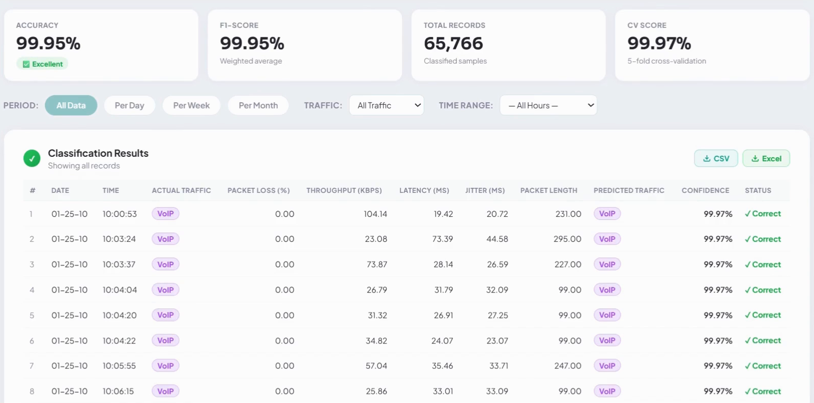
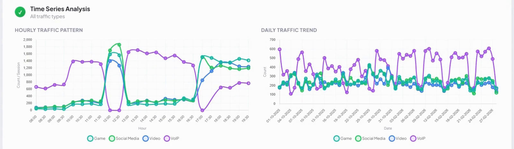
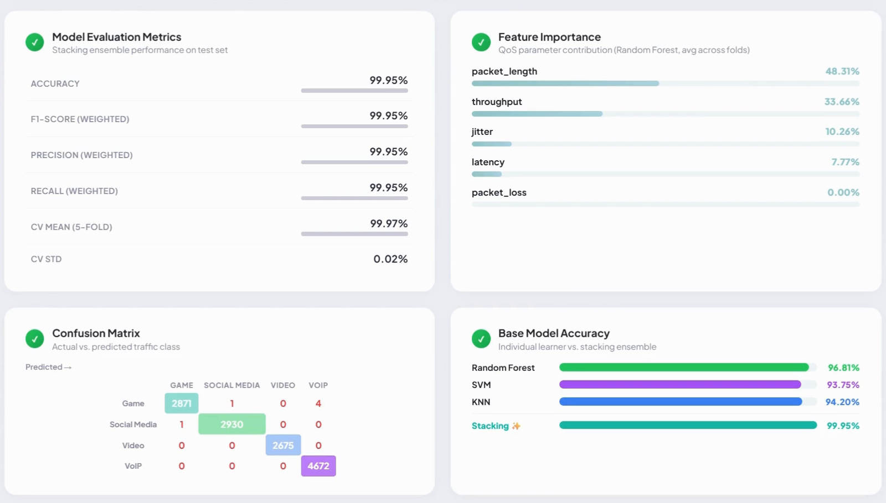
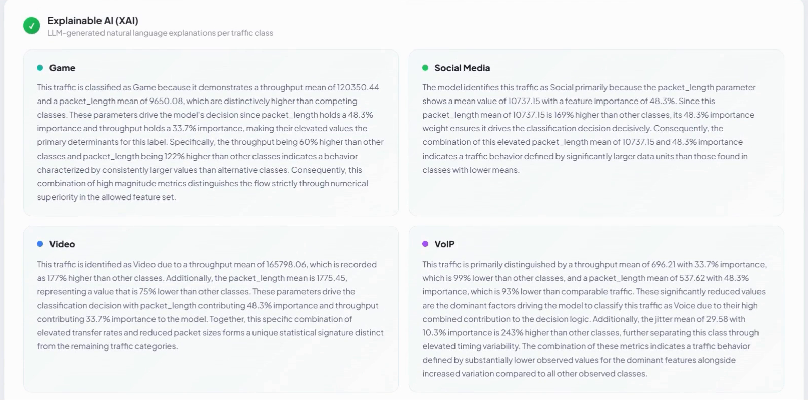

# QoSight: 5G Traffic Classification with Stacking Ensemble, XAI & Time Series Analysis

Undergraduate thesis project, Electrical Engineering, Universitas Indonesia.

**QoSight** classifies 5G network traffic into four service classes (**Game, Social, Video, Voice**) from QoS parameters. It uses a stacking ensemble of KNN, SVM, and Random Forest, explains each class in plain language with an LLM (XAI), and presents everything in an interactive web dashboard with time series analysis.

> 📄 **Paper:** *Traffic Classification for 5G Service Classes using Stacking Ensemble Learning and Time Series Analysis with Integration of XAI and Interactive Dashboard.* Presented at **FORTEI-ICEE 2026** 🏆 **Best Presenter Award**


## Highlights

- **Stacking ensemble:** KNN + SVM + Random Forest as base learners, with Logistic Regression as the meta-learner trained on 5-fold out-of-fold probabilities
- **99.95% test accuracy** on 65,766 real traffic records (13,154 in the test set, 6 misclassified)
- **LLM-based XAI:** for each class, the feature importance and the distinguishing QoS values are passed to an LLM with a strict, number-grounded prompt. The LLM then explains *why* traffic falls into that class.
- **Time series analysis:** hourly patterns, daily trends, an hour × day heatmap, and QoS parameters over time
- **Flask dashboard** with real-time training progress (Server-Sent Events), filters by day/week/month, and CSV/Excel export. You can also upload your own CSV.

## Dashboard







### Explainable AI (XAI)

For each traffic class, the LLM explains the prediction using the feature importance and the actual QoS values of that class.



## Results

Stratified 80/20 split with `random_state=42`. All models below are evaluated on the **same held-out test set**:

| Model | Test accuracy | Misclassified (of 13,154) |
|---|---|---|
| KNN (k=7, distance-weighted) | 94.66% | 702 |
| SVM (RBF, C=10) | 95.60% | 579 |
| Random Forest (200 trees) | 99.96% | 5 |
| **Stacking ensemble** | **99.95%** | 6 |

The stacking model's 5-fold CV accuracy is 99.97% (± 0.02%), and weighted F1, precision, and recall are all 99.95%.

**What the numbers say:**
- Stacking cuts errors by about 99% compared with KNN or SVM on their own (6 errors vs. 579–702).
- Random Forest alone already performs at the same level as the ensemble (5 vs. 6 errors, a difference of one sample). In this dataset, the tree-based model carries most of the predictive power. Here the ensemble's benefit comes from combining different model families, not from a large accuracy gain over RF.
- The dashboard's *Base Model Accuracy* card shows each base learner's mean 5-fold **validation** accuracy (RF 96.81%, KNN 94.20%, SVM 93.75%), next to the stacking **test** accuracy.

**Feature importance** (Random Forest, averaged across folds): packet_length 48.3%, throughput 33.7%, jitter 10.3%, latency 7.8%, packet_loss 0% (packet loss was 0 for every record in this capture).

## Dataset

`data/5g_traffic_dataset.csv`: **65,766 records** of real application traffic, captured over 59 days between October 2025 and February 2026.

| Class | Applications | Records |
|---|---|---|
| Voice | Zoom, Google Meet | 23,356 |
| Social | Instagram, X, Facebook | 14,656 |
| Game | Steam, Riot, Epic | 14,379 |
| Video | YouTube, TikTok, Netflix | 13,375 |

**Features:** `packet_loss`, `throughput`, `latency`, `jitter`, `packet_length`
**Other columns:** `date`, `time`, `range_time`, `traffic_type` (label), `variation_traffic_from` (application), `protocol`

IP address columns were removed from the public version. They are not used by the model.

## How It Works

```
CSV / dataset
   │
   ├─ clean, sort by time, 80/20 stratified split, StandardScaler
   │
   ├─ 5-fold CV ──► KNN ─┐
   │              SVM ──┼─► out-of-fold class probabilities ──► Logistic Regression (meta-learner)
   │              RF  ──┘                                          │
   │                                                               ▼
   ├─ feature importance (RF) + per-class QoS profiles ──► LLM prompt ──► XAI explanation per class
   │
   └─ time series aggregation (hourly / daily / heatmap) ──► dashboard (Flask + Chart.js)
```

## Run Locally

```bash
git clone https://github.com/syahiiralhaddad/5g-traffic-classification-xai.git
cd 5g-traffic-classification-xai
pip install -r requirements.txt

# optional: enable LLM explanations (needs a free HuggingFace token)
export HF_TOKEN=hf_your_token_here      # Windows: set HF_TOKEN=hf_your_token_here
# or skip XAI:  export RUN_XAI=0

python app.py
```

Open http://localhost:5000, click **Get Started**, choose **Use Sample Dataset**, then click **Start Classify**. Training takes a few minutes on a laptop (SVM on ~52k samples × 5 folds is the slow part). Progress streams live in the dashboard.

To use your own data, upload a CSV with at least these columns: `date, time, traffic_type, packet_loss, throughput, latency, jitter, packet_length`.

## Project Structure

```
├── app.py                  # Flask backend: ML pipeline, XAI, SSE progress, API
├── qosight_home.html       # Frontend: landing page + dashboard (single file)
├── data/
│   └── 5g_traffic_dataset.csv
├── images/                 # screenshots for this README
├── requirements.txt
└── .env.example            # HF_TOKEN / RUN_XAI settings
```

## Tech Stack

Python · scikit-learn · pandas · Flask (Server-Sent Events) · HuggingFace Inference (Qwen LLM) · HTML/CSS/JavaScript · Chart.js
